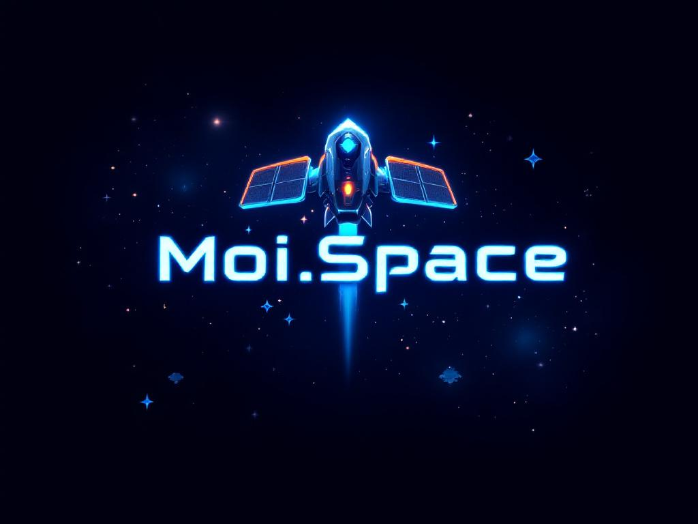

# 🚀 MOI.SPACE

Bienvenue dans MOI.SPACE, un jeu inspiré de Space Invaders, développé avec HTML, CSS et JavaScript.

## 📝 Description

MOI.SPACE est un projet où je crée un jeu de type Space Invaders. En tant que développeur passionné de jeux vidéo classiques, j'ai conçu ce jeu pour offrir une expérience nostalgique avec des graphismes modernes. Vous pouvez jouer, accumuler des points .

Visitez le site ici : [MOI.SPACE]( https://tinx242.github.io/Moi.Space/) 🌐

## ✨ Fonctionnalités

- 🎮 Gameplay classique inspiré de Space Invaders.
- 🚀 Interface intuitive et facile à utiliser.

